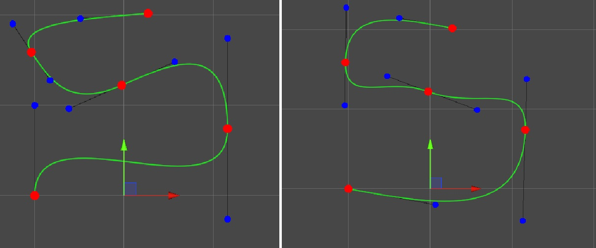

# BP - Unity procederual crossroads/intersection generator 

### Changelog 0.1 (23.2.2023)
* Path Generator
  - Spline
  
  
  - Uzavření smyčky

  
  - Automatické umístění kontrolních bodů

  
  - Sampling rovnoměrně rozložených bodů na křivce

  
  - PathEditor skript, inspektor

  
* Generování cesty
  - Wireframe (lowres/highres)

  
  - Textura

  

  
  - RoadEditor skript, inspektor

  

## Autor

- Koláček Daniel - [github](https://github.com/Salares)
